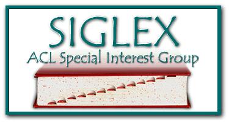

<h2>21st Workshop on Multiword Expressions (MWE 2025)</h2>

**Colocated with:** [NAACL-2025](https://2025.naacl.org/.com), Albuquerque, New Mexico, U.S.A.

**Date of the Workshop:** May 4, 2025 

**Organised and sponsored by:**\
The Special Interest Group on the Lexicon ([SIGLEX](http://www.siglex.org/)) of the Association for Computational Linguistics ([ACL](https://www.aclweb.org/portal/)), SIGLEX's Multiword Expressions Section ([SIGLEX-MWE](https://multiword.org/organization/constitution.html)).

<a href="https://twitter.com/multiword?ref_src=twsrc%5Etfw" class="twitter-follow-button" data-size="large" data-show-screen-name="true" data-show-count="false">@multiword</a>

-----

### News
<!---
* **May 25, 2025**: MWE-UD 2025 workshop
* **May 23, 2025**: Proceedings available
* **April 30, 2025**: Detailed tentative schedule online
* **April 5, 2025**: Acceptance notifications for nonarchival presentations sent
* **April 2, 2025**: Acceptance notifications for archival papers sent
* **February 19, 2025**: MWE-UD 2025 workshop final CfP posted with extended deadline (new submission date: March 3, 2025)
* **February 19, 2025**: MWE-UD 2025 workshop ARR commitment date set (ARR Commitment Date: March 25, 2025)
* **January 31, 2025**: Second CfP posted
* **January 16, 2025**: Keynote speaker Natalia Levshina confirmed
* **January 18, 2025**: Keynote speaker Harish Tayyar Madabushi confirmed
* **December 8, 2023**: First CfP posted
* **December 8, 2023**: MWE-UD 2025 workshop date confirmed (Workshop Date: May 25, 2025)
* **November 21, 2023**: MWE-UD 2025 proposal accepted to LREC-COLING 2025
* **August 29, 2023**: Organising committee formed

-----

<table>
<tr><td>
</td>
<td>

</td></tr></table>
  --->
-----

  

    Contents on this page
  

- [Proceedings and video recording](#proceedings-video)
- [Program](#program)
- [Keynote Speakers](#keynotes)
- [Registration](#registration)
- [Description](#description)
- [Submission Formats](#submission)
- [Paper Submission and Templates](#instructions)
- [Best Paper Award](#award)
- [Important Dates](#dates)
- [Organizing Committee](#organizers)
- [Program Committee](#committee)
- [Sponsors and Support](#sponsors)
- [Anti-harassment Policy](#antiharassment)
- [Contact](#contact)

------

### <a name="proceedings-video"> Proceedings and video recording </a>

TBD

-----

### <a name="program"> Program </a>

TBD

------

### <a name="keynotes">Keynote speaker </a>

[Nathan Schneider](https://people.cs.georgetown.edu/nschneid/) (Georgetown University)

**Bio:** TBA 

**Title:** TBA

**Abstract:** TBA

-----
### <a name="registration"> Registration </a>

To attend the workshop (either in person or virtually), please register through [NAACL 2025’s registration system](tbd.com). Note that to attend MWE 2025, it is sufficient to select this workshop during registration; you do not have to register for the main conference.

------

### <a name="description"> Description </a>

Multiword expressions (MWEs), i.e., word combinations that exhibit lexical, syntactic, semantic, pragmatic, and/or statistical idiosyncrasies (Baldwin and Kim, 2010), such as “by and large”, “hot dog”, “make a decision” and “break one's leg” are still a pain in the neck for Natural Language Processing (NLP). The notion encompasses closely related phenomena: idioms, compounds, light-verb constructions, phrasal verbs, rhetorical figures, collocations, institutionalized phrases, etc. Given their irregular nature, MWEs often pose complex problems in linguistic modeling (e.g. annotation), NLP tasks (e.g. parsing), and end-user applications (e.g. natural language understanding and Machine Translation), hence still representing an open issue for computational linguistics (Constant et al., 2017). 

For more than two decades, modelling and processing MWEs for NLP has been the topic of the MWE workshop organised by the MWE section of SIGLEX in conjunction with major NLP conferences since 2003. Impressive progress has been made in the field, but our understanding of MWEs still requires much research considering their need and usefulness in NLP applications. This is also relevant to domain-specific NLP pipelines that need to tackle terminologies most often realised as MWEs. Following previous years, for this 21st edition of the workshop, we identified the following topics on which contributions are particularly encouraged:

- **MWE processing to enhance end-user applications:** MWEs gained particular attention in end-user applications, including Machine Translation (MT) (Zaninello and Birch, 2020), simplification (Kochmar et al., 2020), language learning and assessment (Paquot et al., 2020), social media mining (Pelosi et al., 2017), and abusive language detection (Zampieri et al. 2020). We believe that it is crucial to extend and deepen these first attempts to integrate and evaluate MWE technology in these and further end-user applications.
- **MWE processing and identification in the general language, as well as in specialized languages and domains:** Multiword terminology extraction from domain-specific corpora (Lossio-Ventura et al, 2014) is of particular importance to various applications, such as MT (Semmar and Laib, 2017), or for the identification and monitoring of neologisms and technical jargon (Chatzitheodorou and Kappatos, 2021).
- **MWE processing in low-resource languages:** The PARSEME shared tasks (2017, 2018, 2020) among others, have fostered significant progress in MWE identification, providing datasets that include low-resource languages, evaluation measures, and tools that now allow fully integrating MWE identification into end-user applications. There are continuous efforts in this direction (Diaz Hernandez, 2024) and a few of them have also explored methods for the automatic interpretation of MWEs (Bhatia et al., 2018), and their processing in low-resource languages (Eder et al., 2021). Resource creation and sharing should be pursued in parallel with the development of multilingual benchmarks for MWE identification (Savary et al., 2023).
- **MWE identification and interpretation in LLMs:** Most current MWE processing is limited to their identification and detection using pre-trained language models, but we still lack understanding about how MWEs are represented and dealt with therein (Garcia et al., 2021), how to better model the compositionality of MWEs from semantics (Phelps et al., 2024). Now that NLP has shifted towards end-to-end neural models like BERT, capable of solving complex tasks with little or no intermediary linguistic symbols, questions arise about the extent to which MWEs should be implicitly or explicitly modelled (Shwartz and Dagan, 2019).
- **New and enhanced representation of MWEs** in language resources and computational models of compositionality as gold standards for formative intrinsic evaluation.

Through this workshop, we will bring together and encourage researchers in various NLP subfields to submit their MWE-related research <!-- so that approaches that deal with the processing of MWEs including processing for low-resource languages and for various applications can benefit from each other!-->. We also intend to consolidate the converging results of previous joint workshops [LAW-MWE-CxG 2018](https://multiword.sourceforge.net/PHITE.php?sitesig=CONF&page=CONF_04_LAW-MWE-CxG_2018___lb__COLING__rb__), [MWE-WN 2019](https://multiword.sourceforge.net/PHITE.php?sitesig=CONF&page=CONF_03_MWE-WN_2019___lb__ACL__rb__) and [MWE-LEX 2020](https://multiword.sourceforge.net/PHITE.php?sitesig=CONF&page=CONF_02_MWE-LEX_2020___lb__COLING__rb__), the [joint MWE-WOAH panel in 2021](https://multiword.org/mwe2021/#program), the [MWE-SIGUL 2022 joint session](https://multiword.org/mwe2022/), and the [MWE-UD 2024](https://multiword.org/mweud2024/), extending our scope to MWEs in e-lexicons and WordNets, MWE annotation, as well as grammatical constructions. Correspondingly, we call for papers on research related (but not limited) to MWEs and constructions in:

* Computationally-applicable theoretical work in psycholinguistics and corpus linguistics; 
* Annotation (expert, crowdsourcing, automatic) and representation in resources such as corpora, treebanks, e-lexicons, WordNets, constructions (also for low-resource languages);  
* Processing in syntactic and semantic frameworks (e.g. CCG, CxG, HPSG, LFG, TAG, UD, etc.); 
* Discovery and identification methods, including for specialized languages and domains such as clinical or biomedical NLP; 
* Interpretation of MWEs and understanding of text containing them; 
* Language acquisition, language learning, and non-standard language (e.g. tweets, speech); 
* Evaluation of annotation and processing techniques; 
* Retrospective comparative analyses from the PARSEME shared tasks;
* Processing for end-user applications (e.g. MT, NLU, summarisation, language learning, etc.);
* Implicit and explicit representation in pre-trained language models and end-user applications;
* Evaluation and probing of pre-trained language models; 
* Resources and tools (e.g. lexicons, identifiers) and their integration into end-user applications;
* Multiword terminology extraction;
* Adaptation and transfer of annotations and related resources to new languages and domains including low-resource ones.

-----

### <a name="submission">Submission Formats</a>

The workshop invites  two types of submissions:

- **Archival submissions** that present substantially original research in both long paper format (8 pages + references) and short paper format (4 pages + references)
- **Non-archival submissions** of abstracts describing relevant research presented/published elsewhere which will not be included in the MWE proceedings.

-----

### <a name="instructions">Paper Submission and Templates</a>

Papers should be submitted via the [OpenReview submission page](https://openreview.net/group?id=aclweb.org/NAACL/2025/Workshop/MWE). Please choose the appropriate submission format (archival/non-archival). Archival papers with existing reviews will also be accepted through the ACL Rolling Review. Submissions must follow the [ACL stylesheet](https://github.com/acl-org/acl-style-files). For further information on this initiative, please refer to [NAACL 2025](https://2025.naacl.org/calls/papers/#paper-submission-details)

The ARR (pre-reviewed)'s paper can be committed [here](https://forms.gle/4XG1Myd3FSdPLkoL6).

-------

### <a name="award">Best Paper Award</a>

TBD

-----

### <a name="dates"> Important Dates </a>

| What                       | When                       |
| -------------------------- | -------------------------- |
| Paper submission deadline  | February 13, 2025           |
| ARR commitment deadline    | February 27, 2025          |
| Notification of acceptance | March 8, 2025              |
| Camera-ready papers due    | March 17, 2025             |
| Underline upload deadline  | April 8, 2025              |
| Workshop                   | May 04, 2025         |

All deadlines are at 23:59 UTC-12 (Anywhere on Earth).

-----

### <a name="organizers"> Organizing Committee (Listed alphabetically)</a>

<table>
  <tr><td>A. Seza Doğruöz </td><td style="padding-left: 20px;">Ghent University, Belgium</td></tr>
  <tr><td>Alexandre Rademaker </td><td style="padding-left: 20px;">IBM Research, Brazil</td></tr>
  <tr><td>Atul Kr. Ojha </td><td style="padding-left: 20px;">Insight Research Ireland Centre for Data Analytics, University of Galway</td></tr>
  <tr><td>Gražina Korvel </td><td style="padding-left: 20px;">VU Institute of Data Science and Digital Technologies</td></tr>    
  <tr><td>Mathieu Constant </td><td style="padding-left: 20px;">Université de Lorraine</td></tr>
  <tr><td>Verginica Barbu Mititelu  </td><td style="padding-left: 20px;">Romanian Academy Research Institute for Artificial Intelligence</td></tr>
  <tr><td>Voula Giouli </td><td style="padding-left: 20px;">Institute for Language & Speech Processing, ATHENA RC, Greece</td></tr>

</table>

-----

### <a name="committee"> Program Committee (to be updated) </a>

| Verginica Barbu Mititelu   | Romanian Academy Research Institute for Artificial Intelligence           |
| Cherifa Ben Kehlil         | University of Tours        |
| Philippe Blache            | Aix-Marseille Uni |
| Francis Bond               | Palacký University         |
| Claire Bonial              | U.S. Army Research Laboratory |
| Julia Bonn                 | University of Colorado Boulder |
| Tiberiu Boroș              | Adobe                      |
| Marie Candito              | Université Paris Cité      |
| Giuseppe G. A. Celano      | Leipzig Uni | 
| Kenneth Church             | Baidu                      |
| Çağrı Çöltekin             | University of Tübingen     |
| Mathieu Constant           | Université de Lorraine     |
| Monika Czerepowicka        | University of Warmia and Mazury |
| Daniel Dakota              | Indiana University         |
| Miryam de Lhoneux          | KU Leuven                  |
| Marie-Catherine de Marneffe | UC Louvain                 |
| Valeria de Paiva           | Nuance                    |
| Gaël Dias                  | University of Caen Basse-Normandie |
| Kaja Dobrovoljc            | University of Ljubljana    |
| Rafael Ehren               | Heinrich Heine University Düsseldorf |
| Gülşen Eryiğit             | Istanbul Technical University |
| Meghdad Farahmand          | Berlin, Germany            |
| Christiane Fellbaum        | Princeton University       |
| Jennifer Foster            | Dublin City University     |
| Aggeliki Fotopoulou        | Institute for Language and Speech Processing, ATHENA RC |
| Stefan Th. Gries           | UC Santa Barbara & JLU Giessen | 
| Bruno Guillaume            | Université de Lorraine     |
| Tunga Gungor               | Bogaziçi University        |
| Eleonora Guzzi             | Universidade da Coruña     |
| Laura Kallmeyer            | Heinrich Heine University Düsseldorf |
| Cvetana Krstev             | University of Belgrade     |
| Timm Lichte                | University of Tübingen     |
| Irina Lobzhanidze          | Ilia State University      |
| Teresa Lynn                | ADAPT Centre               |
| Stella Markantonatou       | Institute for Language & Speech Processing, ATHENA RC |
| John P. McCrae             | National University of Ireland, Galway |
| Nurit Melnik               | The Open University of Israel |
| Johanna Monti              | "L'Orientale" University of Naples |
| Dmitry Nikolaev            | University of Manchester |
| Jan Odijk                  | University of Utrecht      |
| Petya Osenova              | Bulgarian Academy of Sciences |
| Yannick Parmentier         | University of Lorraine     |
| Agnieszka Patejuk          | University of Oxford and Institute of Computer Science, Polish Academy of Sciences |
| Pavel Pecina               | Charles University |
| Ted Pedersen               | University of Minnesota |
| Prokopis Prokopidis        | Institute for Language and Speech Processing, ATHENA RC |
| Manfred Sailer             | Goethe-Universität Frankfurt am Main |
| Tanja Samardžić            | University of Zurich |
| Agata Savary               | Université Paris-Saclay |
| Nathan Schneider           | Georgetown University |
| Sabine Schulte im Walde    | University of Stuttgart |
| Sebastian Schuster         | Saarland University |
| Matthew Shardlow           | University of Manchester |
| Joaquim Silva              | Universidade NOVA de Lisboa |
| Maria Simi                 | Università di Pisa |
| Ranka Stanković            | University of Belgrade |
| Ivelina Stoyanova          | Bulgarian Academy of Sciences |
| Stan Szpakowicz            | University of Ottawa |
| Shiva Taslimipoor          | University of Cambridge |
| Beata Trawinski            | Leibniz Institute for the German Language |
| Ashwini Vaidya             | Indian Institute of Technology |
| Marion Di Marco            | Ludwig Maximilian University of Munich |
| Amir Zeldes                | Georgetown University |
| Daniel Zeman               | Charles University |

-----

### <a name="sponsors"> Sponsors and Support </a>

    

        
    

-----

### <a name="antiharassment"> Anti-harassment Policy </a>

The workshop follows the [ACL anti-harassment policy](https://www.aclweb.org/adminwiki/index.php?title=Anti-Harassment_Policy).

-----

### <a name="contact"> Contact </a>

For any inquiries regarding the workshop, please send an email to the Organizing Committee at [mwe2025workshop@gmail.com](mailto:mwe2025workshop@gmail.com).

Please register to [SIGLEX](../organization/members) and check the "MWE
Section" box to be registered to our [mailing list](../mailinglist).

