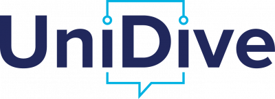
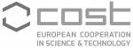

<h2>22nd Workshop on Multiword Expressions (MWE 2026)</h2>

**Colocated with:** [EACL-2026](https://2026.eacl.org), Rabat, Marocco

**Date of the Workshop:** 28 March, 9:00-12:30

**Organised and sponsored by:**\
The Special Interest Group on the Lexicon ([SIGLEX](http://www.siglex.org/)) of the Association for Computational Linguistics ([ACL](https://www.aclweb.org/portal/)), SIGLEX's Multiword Expressions Section ([SIGLEX-MWE](https://multiword.org/organization/constitution.html)), [UniDive COST Action CA21167](https://unidive.lisn.upsaclay.fr/).

<a href="https://twitter.com/multiword?ref_src=twsrc%5Etfw" class="twitter-follow-button" data-size="large" data-show-screen-name="true" data-show-count="false">@multiword</a>

-----

### News
<!---
* **May 25, 2025**: MWE-UD 2025 workshop
* **May 23, 2025**: Proceedings available
* **April 30, 2025**: Detailed tentative schedule online
* **April 5, 2025**: Acceptance notifications for nonarchival presentations sent
* **April 2, 2025**: Acceptance notifications for archival papers sent
* **February 19, 2025**: MWE-UD 2025 workshop final CfP posted with extended deadline (new submission date: March 3, 2025)
* **February 19, 2025**: MWE-UD 2025 workshop ARR commitment date set (ARR Commitment Date: March 25, 2025)
* **January 31, 2025**: Second CfP posted
* **January 16, 2025**: Keynote speaker Natalia Levshina confirmed
* **January 18, 2025**: Keynote speaker Harish Tayyar Madabushi confirmed
* **December 8, 2023**: First CfP posted
* **December 8, 2023**: MWE-UD 2025 workshop date confirmed (Workshop Date: May 25, 2025)
* **November 21, 2023**: MWE-UD 2025 proposal accepted to LREC-COLING 2025
* **August 29, 2023**: Organising committee formed

-----

<table>
<tr><td>
</td>
<td>

</td></tr></table>
  --->
-----

  

    Contents on this page
  

- [Proceedings and video recording](#proceedings-video)
- [Program](#program)
- [Keynote Speakers](#keynotes)
- [Registration](#registration)
- [Description](#description)
- [Shared tasks](#sharedtasks)
- [Submission Formats](#submission)
- [Paper Submission and Templates](#instructions)
- [In Memoriam](#inmemoriam)
- [Best Paper Award](#award)
- [Important Dates](#dates)
- [Organizing Committee](#organizers)
- [Program Committee](#committee)
- [Sponsors and Support](#sponsors)
- [Anti-harassment Policy](#antiharassment)
- [Contact](#contact)

------

### <a name="proceedings-video"> Proceedings and video recording </a>

TBA

-----

### <a name="program"> Program </a>

TBA

### <a name="keynotes">Keynote speaker </a>

TBA

-----
### <a name="registration"> Registration </a>

To attend the workshop (either in person or virtually), please register through [EACL 2026’s registration system](https://2026.eacl.org/registration). Note that to attend MWE 2026, it is sufficient to select this workshop during registration; you do not have to register for the main conference.

------

### <a name="description"> Description </a>

Multiword expressions (MWEs), i.e., word combinations that exhibit lexical, syntactic, semantic, pragmatic, and/or statistical idiosyncrasies (Baldwin and Kim, 2010), such as “by and large”, “hot dog”, “make a decision” and “break one's leg” are still a pain in the neck for Natural Language Processing (NLP). The notion of MWE encompasses closely related phenomena: idioms, compounds, light-verb constructions, phrasal verbs, rhetorical figures, collocations, institutionalized phrases, etc. Given their irregular nature, MWEs often pose complex problems in linguistic modeling (e.g., annotation), NLP tasks (e.g., parsing), and end-user applications (e.g., natural language understanding and Machine Translation), hence still representing an open issue for computational linguistics (Miletić and Schulte im Walde, 2024; Ramisch et al., 2023; Phelps et al., 2024; Mahajan et al., 2024).

For more than two decades, the topic of modeling and processing MWEs for NLP has been the focus of the MWE workshop, organized by the [MWE section](https://multiword.org/) of [ACL-SIGLEX](http://www.siglex.org/) in conjunction with major NLP conferences since 2003. Impressive progress has been made in the field, but our understanding of MWEs still requires much research, considering their need and usefulness in NLP applications. This is also relevant to domain-specific NLP pipelines that need to tackle terminologies most often realized as MWEs. 

**Topics of interest** include, but are not limited to:
* Computationally-applicable theoretical work in psycholinguistics and corpus linguistics;
* Annotation (expert, crowdsourcing, automatic) and representation in resources such as corpora, treebanks, e-lexicons, WordNets, constructions (also for low-resource languages);
* Processing in syntactic and semantic frameworks (e.g. CCG, CxG, HPSG, LFG, TAG, UD, etc.);
* Discovery and identification methods, including for specialized languages and domains such as clinical or biomedical NLP;
* Interpretation of MWEs and understanding of text containing them;
* Language acquisition, language learning, and non-standard language (e.g. tweets, speech);
* Evaluation of annotation and processing techniques;
* Retrospective comparative analyses from the PARSEME shared tasks;
* Processing for end-user applications (e.g. MT, NLU, summarisation, language learning, etc.);
* Implicit and explicit representation in pre-trained language models and end-user applications;
* Evaluation and probing of pre-trained language models;
* Resources and tools (e.g. lexicons, identifiers) and their integration into end-user applications;
* Multiword terminology extraction;
* Adaptation and transfer of annotations and related resources to new languages and domains including low-resource ones.

### <a name="sharedtasks"> Co-located Shared tasks</a>

The workshop MWE 2026 will host [two shared tasks](https://unidive.lisn.upsaclay.fr/doku.php?id=other-events:parseme-admire-st-call#call_for_participation):
* PARSEME 2.0, whose objective is to identify and paraphrase MWEs in written text, and
* AdMIRe 2 (Advancing Multimodal Idiomaticity Representation), which explores the comprehension ability of multimodal models for MWEs in a variety of languages.

-----

### <a name="submission">Submission Formats</a>

The workshop invites  two types of submissions:

- **Archival submissions** that present substantially original research in both long paper format (8 pages + references) and short paper format (4 pages + references)
- **Non-archival submissions** of abstracts describing relevant research presented/published elsewhere which will not be included in the MWE proceedings (8 pages + references).

-----

### <a name="instructions">Paper Submission and Templates</a>

Papers should be submitted via the [workshop's submission page](https://openreview.net/group?id=eacl.org/EACL/2026/Workshop/MWE). Please choose the appropriate submission format (archival/non-archival). Archival papers with existing reviews will also be accepted through the ACL Rolling Review. Submissions must follow the [ACL stylesheet](https://github.com/acl-org/acl-style-files).

Authors are encouraged, wherever relevant, to adopt the [conventions on citing, glossing and translating multilingual examples of MWEs](https://gitlab.com/parseme/pmwe/-/blob/master/Conventions-for-MWE-examples/PMWE_series_conventions_for_multilingual_examples.pdf) promoted by the editors of the [Phraseology and Multiword Expressions book series](https://langsci-press.org/catalog/series/pmwe) published by Language Science Press. 

<!--
Papers should be submitted via the [OpenReview submission page](https://openreview.net/group?id=aclweb.org/NAACL/2025/Workshop/MWE). Please choose the appropriate submission format (archival/non-archival). Archival papers with existing reviews will also be accepted through the ACL Rolling Review. Submissions must follow the [ACL stylesheet](https://github.com/acl-org/acl-style-files). For further information on this initiative, please refer to [NAACL 2025](https://2025.naacl.org/calls/papers/#paper-submission-details)

The ARR (pre-reviewed)'s paper can be committed [here](https://forms.gle/4XG1Myd3FSdPLkoL6).
-->
------

### <a name="inmemoriam">In Memoriam</a>

The PARSEME community wishes to pay tribute to two of our colleagues who passed away in 2025: Federico Sangati and Silvio Ricardo Cordeiro, two wonderful people who greatly contributed to our assets.

[Read the full tribute here](https://gitlab.com/parseme/corpora/-/wikis/Federico-and-Silvio)

-------

### <a name="award">Best Paper Award</a>
TBA

-----

### <a name="dates"> Important Dates </a>

| What                       | When                       |
| -------------------------- | -------------------------- |
| Direct Submission deadline  | December <s>19</s> 27, 2025           |
| Pre-reviewed (ARR) submission deadline    |  January 5, 2026         |
| Notification of acceptance | January <s>23</s> 27, 2026              |
| Camera-ready papers due    | February 7, 2026             |
| Workshop                   | March 28, 2026         |

All deadlines are at 23:59 UTC-12 (Anywhere on Earth).

-----

### <a name="organizers"> Organizing Committee (Listed alphabetically)</a>

<table>
  <tr><td>Verginica Barbu Mititelu  </td><td style="padding-left: 20px;">Romanian Academy Research Institute for Artificial Intelligence</td></tr>
  <tr><td>A. Seza Doğruöz </td><td style="padding-left: 20px;">Ghent University, Belgium</td></tr>
  <tr><td>Alexandre Rademaker </td><td style="padding-left: 20px;">FGV/EMA, Brazil</td></tr>
  <tr><td>Atul Kr. Ojha </td><td style="padding-left: 20px;">Insight Research Ireland Centre for Data Analytics, University of Galway</td></tr>
  <tr><td>Ivelina Stoyanova  </td><td style="padding-left: 20px;">Institute for Bulgarian Language</td></tr>
  <tr><td>Mathieu Constant </td><td style="padding-left: 20px;">Université de Lorraine</td></tr>
  

</table>

-----

### <a name="committee"> Program Committee </a>

TBA

<!---

|	Agata Savary	|	Université Paris-Saclay	|
|	Beata Trawinski	|	Leibniz Institute for the German Language	|
|	Carlos Ramisch	|	LIS - Laboratoire d'Informatique et Systèmes	|
|	Chikara Hashimoto	|	Rakuten Institute of Technology	|
|	Cvetana Krstev	|	University of Belgrade, Faculty of Philology	|
|	Eric G C Laporte	|	Université Gustave Eiffel	|
|	Francis Bond	|	Palacký University Olomouc	|
|	Gaël Dias	|	University of Caen Normandy	|
|	Gražina Korvel	|	Vilnius University	|
|	Irina Lobzhanidze	|	Ilia Chavchavadze State University	|
|	Ismail El Maarouf	|	Imprevicible	|
|	Ivelina Stoyanova	|	Deaf Studies Institute	|
|	Jan Odijk	|	Utrecht University	|
|	John Philip McCrae	|	National University of Ireland Galway	|
|	Kenneth Church	|	Northeastern University	|
|	Manfred Sailer	|	Johann Wolfgang Goethe Universität Frankfurt am Main	|
|	Mathieu Constant	|	Université de Lorraine, CNRS, ATILF	|
|	Matthew Shardlow	|	The Manchester Metropolitan University	|
|	Meghdad Farahmand	|	University of Genoa	|
|	Miriam Butt	|	Universität Konstanz	|
|	Paul Cook	|	University of New Brunswick	|
|	Pavel Pecina	|	Charles University	|
|	Petya Osenova	|	Sofia University "St. Kliment Ohridski"	|
|	Ranka Stanković	|	University of Belgrade	|
|	Sabine Schulte im Walde	|	University of Stuttgart	|
|	Shiva Taslimipoor	|	University of Cambridge	|
|	Stan Szpakowicz	|	University of Ottawa	|
|	Stella Markantonatou	|	ATHENA RIC	|
|	Tiberiu Boros	|	Adobe Systems	|
|	Tunga Gungor	|	Bogazici University	|

--->

-----

### <a name="sponsors"> Sponsors and Support </a>

    

        
    

  

        
    

  

        
    

  

        
    

-----

### <a name="antiharassment"> Anti-harassment Policy </a>

The workshop follows the [ACL anti-harassment policy](https://www.aclweb.org/adminwiki/index.php?title=Anti-Harassment_Policy).

-----

### <a name="contact"> Contact </a>

For any inquiries regarding the workshop, please send an email to the Organizing Committee at [mwe2026workshop@gmail.com](mailto:mwe2026workshop@gmail.com).

Please register to [SIGLEX](../organization/members) and check the "MWE
Section" box to be registered to our [mailing list](../mailinglist).
