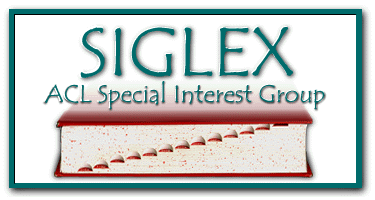
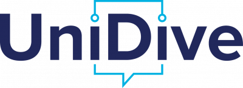
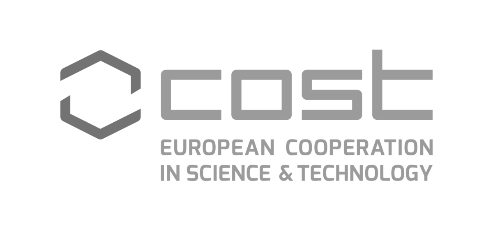

<h2>23rd Workshop on Multiword Expressions (MWE 2027)</h2>

**Colocated with:** <a href="https://2027.eacl.org" target="_blank">EACL-2027</a>, Athens, Greece

**Date of the Workshop:** one full day between March 9–14, 2027 (Exact date TBA) <!--XX March, XX:XX-XX:XX-->

**Organised and sponsored by:**\
The Special Interest Group on the Lexicon (<a href="http://www.siglex.org/" target="_blank">SIGLEX</a>) of the Association for Computational Linguistics (<a href="https://www.aclweb.org/portal/" target="_blank">ACL</a>) and SIGLEX's Multiword Expressions Section (<a href="https://multiword.org/organization/constitution.html" target="_blank">SIGLEX-MWE</a>).

<a href="https://twitter.com/multiword?ref_src=twsrc%5Etfw" class="twitter-follow-button" data-size="large" data-show-screen-name="true" data-show-count="false">@multiword</a>

-----

### News

<!--* **December 8, 2023**: First Call for Participation posted -->
<!--* **December 8, 2026**: MWE 2027 workshop date confirmed (Workshop Date: March XX, 2027)-->
* **October 3, 2026**: MWE 2027 proposal accepted to EACL 2027
* **September 16, 2026**: Organising committee formed

<!---
* **May 25, 2025**: MWE-UD 2025 workshop
* **May 23, 2025**: Proceedings available
* **April 30, 2025**: Detailed tentative schedule online
* **April 5, 2025**: Acceptance notifications for nonarchival presentations sent
* **April 2, 2025**: Acceptance notifications for archival papers sent
* **February 19, 2025**: MWE-UD 2025 workshop final CfP posted with extended deadline (new submission date: March 3, 2025)
* **February 19, 2025**: MWE-UD 2025 workshop ARR commitment date set (ARR Commitment Date: March 25, 2025)
* **January 31, 2025**: Second CfP posted
* **January 16, 2025**: Keynote speaker Natalia Levshina confirmed
* **January 18, 2025**: Keynote speaker Harish Tayyar Madabushi confirmed
* **December 8, 2023**: First CfP posted
* **December 8, 2023**: MWE-UD 2025 workshop date confirmed (Workshop Date: May 25, 2025)
* **November 21, 2023**: MWE-UD 2025 proposal accepted to LREC-COLING 2025
* **August 29, 2023**: Organising committee formed

-----

<table>
<tr><td>
</td>
<td>

</td></tr></table>
  --->
-----

  

    Contents on this page
  

<!-- - [Proceedings and video recording](#proceedings-video) -->
<!-- - [Program](#program) -->
- [Registration](#registration)
- [Description](#description)
<!-- - [Shared tasks](#sharedtasks) -->
- [Submission Formats](#submission)
- [Paper Submission and Templates](#instructions)
- [In Memoriam](#inmemoriam)
- [Important Dates](#dates)
- [Organizing Committee](#organizers)
- [Program Committee](#committee)
- [Sponsors and Support](#sponsors)
- [Anti-harassment Policy](#antiharassment)
- [Contact](#contact)

<!--
------

### <a name="proceedings-video"> Proceedings and video recording </a>

The [proceedings](https://aclanthology.org/volumes/2026.mwe-1/) are available in the ACL Anthology.

The recordings are available [here](https://drive.google.com/file/d/1PokEhDF2wWdGrnwJ_OmpQGPP2bNXzspn/view?usp=drive_link).

-----
-->

<!--
### <a name="program"> Program </a>

<table class="program">
  <tr>
    <th>Time</th>
    <th>Session</th>
  </tr>

  <tr><th>09:00–09:15</th><th><i>Welcome and Introduction to 22nd MWE Workshop</I></th></tr>
  <tr><td></td><td>Session chair: Agata Savary</td></tr>

  <tr><th>09:15–09:45</th><th><i>Findings of the MWE 2026 Shared Tasks</I></th> </tr>
  <tr><td></td><td>Session chair: Dilara Torunoğlu</td></tr>
<tr>
        <td></td>
<td>Edition 2.0 of the PARSEME shared task on multilingual identification and paraphrasing of multiword expressions 
Manon Scholivet, Agata Savary, Carlos Ramisch, Eric Bilinski, Takuya Nakamura, Maria Mitrofan and Vasile Pais</td>
</tr>

<tr>
        <td></td>
<td><I>MWE-2026 Shared Task: AdMIRe 2 Advancing Multimodal Idiomaticity Representation</I> Doğukan Arslan, Rodrigo Wilkens, Wei He, Dilara Torunoglu Selamet, Thomas
Pickard, Aline Villavicencio, Adriana Silvina Pagano and Gülşen Eryiğit</td>
</tr>

 

  <tr><th>09:45–10:30</th><th>Poster session</th></tr>
  <tr><td></td><td>Session chair: Sara Stymne</td></tr>
  <tr><td></td><td>
    <I>Large Language Models Put to the Test on Chinese Noun Compounds: Experiments on Natural Language Inference and Compound Semantics</I> 
Le Qiu, Emmanuele Chersoni, He Zhou and Yu-Yin Hsu
  </td></tr>

  <tr><td></td><td>
    <I>SinFoS: A Parallel Dataset for Translating Sinhala Figures of Speech</i> 
Johan Nevin Sofalas, Dilushri Pavithra, Nevidu Jayatilleke and Ruvan Weerasinghe
  </td></tr>

  <tr><td></td><td>
   <I>Ukrainian Multiword Expressions Corpus: Creation, Annotation, and Linguistic Analysis</i> 
Hanna Sytar, Maria Shvedova and Olha Kanishcheva
  </td></tr>

<tr><td></td><td>
   <I>Cheese it up: CamemBERT Outperforms Large Language Models for Identification of French Multi-word Expressions</I> 
Sergei Bagdasarov, Diego Alves and Elke Teich
  </td></tr>

<tr><td></td><td>
   <I>Extracting Multi-Word Expressions Representing Technical Terms and Proper Nouns in Log Messages</I> 
Kilian Dangendorf, Sven-Ove Hänsel, Jannik Rosendahl, Felix Heine, Carsten Kleiner and Christian Wartena
  </td></tr>

<tr><td></td><td>
   <I>Two Birds with One Stone: Annotating Romanian Multiword Expressions with an Eye to the PARSEME 2.0 Guidelines Applicability</I> 
Verginica Mititelu, Mihaela Cristescu, Elena Irimia and Carmen Mîrzea Vasile
  </td></tr>

<tr><td></td><td>
   <I>Incorporating Multiword Expressions in Galician Neural Machine Translation: Compositionality, Efficiency, and Performance</I> 
Daniel Solla, Paula Pinto-Ferro, Laura Castro, Pablo Gamallo and Marcos Garcia
  </td></tr>

<tr><td></td><td>
  <I>Beyond Single Words: MWE Identification in Bioinformatics Research Articles and Dispersion Profiling Across IMRaD</I> 
Jurgi Giraud and Andrew Gargett
  </td></tr>

<tr><td></td><td>
   <I>The Lock, Stock, and Barrel of Marathi Multiwords</I> 
Aakanksha Padhye and Ashwini Vaidya
  </td></tr>

<tr><td></td><td>
  <I>An Idiom Benchmark for Turkish</I> 
Ebru Çavuşoğlu and Cagri Coltekin
  </td></tr>

<tr><td></td><td>
   <I>A Curious Class of Adpositional Multiword Expressions in Korean</I> 
Junghyun Min, Na-Rae Han, Jena D. Hwang and Nathan Schneider
  </td></tr>

<tr><td></td><td>
  <I>PolyFrame at MWE-2026 AdMIRe 2: When Words Are Not Enough: Multimodal Idiom Disambiguation</I> 
Nina Hosseini-Kivanani
  </td></tr>

<tr><td></td><td>
   <I>IdiomRanker-X at MWE-2026 AdMIRe 2: Multilingual Idiom-Image Alignment via Low-Rank Adaptation of Cross-Encoders</I> 
Mehmet Utku Colak
  </td></tr>

<tr><td></td><td>
  <I>alexandru412 at MWE-2026 AdMIRe 2.0: Advancing Multimodal Idiomaticity Representation</I> 
Cristea Alexandru-Marian
  </td></tr>

<tr><td></td><td>
   <I>BeeParser at MWE-2026 PARSEME 2.0 Subtask 1: Can Cross-Lingual Interactions Improve MWE Identification?</I> 
Ahmet Erdem and Oguzhan Karaarslan
  </td></tr>

<tr><td></td><td>
  <I>VisAffect at MWE-2026 AdMIRe 2: IMMCAN Idiom Multimodal Cross-Attention Network</I> 
Barış Bilen, Ali Azmoudeh, Hazım Kemal Ekenel and Hatice Kose
  </td></tr>

<tr><td></td><td>
  <I>Sahara Tokenizers at PARSEME 2.0 Subtask 1: Combining Contextual Embeddings with Structural Decoding for Multi-Word Expression Detection</I> 
Yunus Karatepe, Mert Sülük, Zeynep Tuğçe Kırımlı and Begüm Özbay
  </td></tr>

<tr><td></td><td>
  <I>3K2T at MWE-2026 AdMIRe 2: CARIM– Category-Aware Reasoning for Idiomatic Multimodality</I> 
Kubilay Kağan Kömürcü and Tugce Temel
  </td></tr>
<tr><td></td><td>
  <I>PMI MWE Scorer at PARSEME 2.0 Subtask 1: identifying multi-word expressions using pointwise mutual information and universal dependencies</I> 
Anna Bogdanova and Ileana Bucur
  </td></tr>

<tr><td></td><td>
 <I>tiberiucarp at MWE-2026 AdMIRe 2: GLIMMER-Gloss-based Image Multiword Meaning Expression Ranker</I> 
Andrei Tiberiu Carp
  </td></tr>

<tr><td></td><td>
  <I>IPN at MWE-2026 PARSEME 2.0 Subtask 1: MWE Identification via Related Languages and Harnessing Thinking Mode</I> 
Anna Hülsing, Noah-Manuel Michael, Daniel Mora Melanchthon and Andrea
Horbach
  </td></tr>

<tr><td></td><td>
  <I>Semantic Stars at MWE-2026 PARSEME 2.0 Subtask 2: Alternative Approaches for MWE Paraphrasing</I> 
Elif Bayraktar, Vedat Doğancan, Muhammed Abdullah Gümüş and Nusret Ali Kızılaslan
  </td></tr>

<tr><td></td><td>
  <I>MorphoFiltered-Gemini at MWE-2026 PARSEME 2.0 Subtask 1: Tackling LLM Overgeneration via Universal POS-based Constraints</I> 
Irina Moise and Sergiu Nisioi
  </td></tr>

<tr><td></td><td>
  <I>LST at MWE-2026 AdMIRe 2: Advancing Multimodal Idiomaticity Representation</I> 
Le Qiu, Yu-Yin Hsu and Emmanuele Chersoni
  </td></tr>

<tr><td></td><td>
<i>UniBO at MWE-2026 PARSEME 2.0 Subtask 2: A Cross-lingual Approach to Multiword Expression Paraphrasing</I> Debora Ciminari and Alberto Barrón-Cedeño  
  </td></tr>

<tr><td></td><td>
<I>DCSN-NLP at MWE-2026 AdMIRe 2: Bridging Literal and Figurative Meaning Through Hierarchical Multimodal Reasoning</I> 
David Cotiga and Sergiu Nisioi  
  </td></tr>

<tr><td></td><td>
  <i>ITUNLP at MWE-2026 AdMIRe 2: A Zero-Shot LLM Pipeline for Multimodal Idiom Understanding and Ranking</I> 
Atakan Site, Oğuz Ali Arslan and Gülşen Eryiğit
  </td></tr>

<tr><td></td><td>
  <I>Archaeology at WE-2026 PARSEME 2.0 Subtask 1 and 2: Parsing is for Encoders, Paraphrasing is for LLMs</I> 
Rares-Alexandru Roscan and Sergiu Nisioi
  </td></tr>

<tr><td></td><td>
  <I>ITUNLP2 at MWE-2026 AdMIRe 2: Modular Zero-Shot Pipelines for Multimodal Idiom Grounding and Ranking</I> 
Özge Umut and Bora Şenceylan
  </td></tr>

 <tr><th>10:30–11:00</th><th>Coffee break</th></tr>

  <tr><th>11:00–11:45</th><th>Oral session</th></tr>
        <td></td>
<td>Session chair: Atul Kr. Ojha</td>
</tr>
  <tr><td></td><td>
     <i>Swedish Multiword Expression Corpora in PARSEME</I> 
Sara Stymne, Astrid Berntsson Ingelstam and Eva Pettersson
  </td></tr>
  <tr><td></td><td><I>Cognitive Signatures of Multi-Word Expressions: Reading-Time and Surprisal</I> 
Diego Alves, Sergei Bagdasarov and Elke Teich
  </td></tr>
  <tr><td></td><td><I>Diversity patterns run deep: Impact of diversity intake on multiword expression identification</I> 
Mathilde Deletombe, Manon Scholivet, Louis Estève, Thomas Lavergne and Agata Savary
  </td></tr>

  <tr><th>11:45–12:05</th><th>Community discussion</th></tr>
  <tr><td></td><td>Session chair: Atul K. Ojha</td></tr>
  <tr><th>12:05–12:15</th><th>Concluding remarks</th></tr>
    
</table>
-->

-----
### <a name="registration"> Registration </a>

To attend the workshop <!--(either in person or virtually)-->, please register through <a href="https://2027.eacl.org" target="_blank">EACL 2027’s registration system</a>. Note that to attend MWE 2027, it is sufficient to select this workshop during registration; you do not have to register for the main conference.

------

### <a name="description"> Description </a>

Multiword expressions (MWEs), i.e., word combinations that exhibit lexical, syntactic, semantic, pragmatic, and/or statistical idiosyncrasies (Baldwin and Kim, 2010), such as “by and large”, “hot dog”, “make a decision” and “break one's leg” are still a pain in the neck for Natural Language Processing (NLP). The notion of MWE encompasses closely related phenomena: idioms, compounds, light-verb constructions, phrasal verbs, rhetorical figures, collocations, institutionalized phrases, etc. Given their irregular nature, MWEs often pose complex problems in linguistic modeling (e.g., annotation), NLP tasks (e.g., parsing), and end-user applications (e.g., natural language understanding and Machine Translation), hence still representing an open issue for computational linguistics (Miletić and Schulte im Walde, 2024; Ramisch et al., 2023; Phelps et al., 2024; Mahajan et al., 2024).

For more than two decades, the topic of modeling and processing MWEs for NLP has been the focus of the MWE workshop, organized by the <a href="https://multiword.org" target="_blank">MWE section</a> of <a href="http://www.siglex.org" target="_blank">ACL-SIGLEX</a> in conjunction with major NLP conferences since 2003. Impressive progress has been made in the field, but our understanding of MWEs still requires much research, considering their need and usefulness in NLP applications. This is also relevant to domain-specific NLP pipelines that need to tackle terminologies most often realized as MWEs.

**Topics of interest** include, but are not limited to:
* Linguistic aspects of MWE: criteria for their classification, morpho-syntactic and semantic idiosyncrasies, contrastive studies of MWEs in various languages;
* MWE resources: corpora, dictionaries, lexicons, treebanks, mono-/multilingual, new and enhanced representation of MWEs in language resources, computational models of compositionality as gold standards for formative intrinsic evaluation, development of multilingual benchmarks for MWE identification;
* MWE processing, identification, and recognition in the general language, as well as in specialized languages and domains, including in low-resourced languages;
* MWEs in LLMs and embeddings: representation, compositionality, and phrase-level embeddings, adapting LLMs to better handle MWEs, probing LLMs’ understanding of MWEs; 
* MWE processing to enhance end-user applications.

<!--
* Computationally-applicable theoretical work in psycholinguistics and corpus linguistics;
* Annotation (expert, crowdsourcing, automatic) and representation in resources such as corpora, treebanks, e-lexicons, WordNets, constructions (also for low-resource languages);
* Processing in syntactic and semantic frameworks (e.g. CCG, CxG, HPSG, LFG, TAG, UD, etc.);
* Discovery and identification methods, including for specialized languages and domains such as clinical or biomedical NLP;
* Interpretation of MWEs and understanding of text containing them;
* Language acquisition, language learning, and non-standard language (e.g. tweets, speech);
* Evaluation of annotation and processing techniques;
* Retrospective comparative analyses from the PARSEME shared tasks;
* Processing for end-user applications (e.g. MT, NLU, summarisation, language learning, etc.);
* Implicit and explicit representation in pre-trained language models and end-user applications;
* Evaluation and probing of pre-trained language models;
* Resources and tools (e.g. lexicons, identifiers) and their integration into end-user applications;
* Multiword terminology extraction;
* Adaptation and transfer of annotations and related resources to new languages and domains including low-resource ones.
-->

<!--
### <a name="sharedtasks"> Co-located Shared tasks</a>

The workshop MWE 2026 will host [two shared tasks](https://unidive.lisn.upsaclay.fr/doku.php?id=other-events:parseme-admire-st-call#call_for_participation):
* PARSEME 2.0, whose objective is to identify and paraphrase MWEs in written text, and
* AdMIRe 2 (Advancing Multimodal Idiomaticity Representation), which explores the comprehension ability of multimodal models for MWEs in a variety of languages.
-->

-----

### <a name="submission">Submission Formats</a>

The workshop invites two types of submissions:
- **Archival submissions** that present substantially original research in both long paper format (8 pages + references) and short paper format (4 pages + references)
- **System and resource demonstrations** that present tools and datasets related to MWEs and MWE processing, which could be demoed during the workshop. System/resource description papers should be up to 4 pages + references, and do not need to be anonymized.
- **Non-archival submissions** describing relevant research presented/published elsewhere; non-archival submissions will not be included in the MWE proceedings and do not need to be anonymized (they will not undergo reviews); they should contain a short abstract of the paper (1-2 pages) with a link to the already published paper.

-----

### <a name="instructions">Paper Submission and Templates</a>

<!--Papers should be submitted via the [workshop's submission page](https://openreview.net/group?id=eacl.org/EACL/2027/Workshop/MWE).-->

Papers should be submitted via the workshop's submission page (link TBA). Please choose the appropriate submission format (archival/system/non-archival). Archival papers with existing reviews will also be accepted through the ACL Rolling Review. Submissions must follow the <a href="https://github.com/acl-org/acl-style-files" target="_blank">ACL stylesheet</a>.

Authors are encouraged, wherever relevant, to adopt the <a href="https://gitlab.com/parseme/pmwe/-/blob/master/Conventions-for-MWE-examples/PMWE_series_conventions_for_multilingual_examples.pdf" target="_blank">conventions on citing, glossing and translating multilingual examples of MWEs</a> promoted by the editors of the <a href="https://langsci-press.org/catalog/series/pmwe" target="_blank">Phraseology and Multiword Expressions book series</a> published by Language Science Press.

<!--
Papers should be submitted via the [OpenReview submission page](https://openreview.net/group?id=aclweb.org/NAACL/2025/Workshop/MWE). Please choose the appropriate submission format (archival/non-archival). Archival papers with existing reviews will also be accepted through the ACL Rolling Review. Submissions must follow the [ACL stylesheet](https://github.com/acl-org/acl-style-files). For further information on this initiative, please refer to [NAACL 2025](https://2025.naacl.org/calls/papers/#paper-submission-details)

The ARR (pre-reviewed)'s paper can be committed [here](https://forms.gle/4XG1Myd3FSdPLkoL6).
-->

------
### <a name="inmemoriam">In Memoriam</a>

The PARSEME/UniDive community wishes to pay tribute to one of our colleagues who passed away in 2026: Gosse Bouma, who was an active member of WG1 and WG3 in UniDive, and in its two underlying communities: Universal Dependencies and PARSEME. He acted towards improving annotation consistency across treebanks and languages, maintained the Dutch UD treebanks, and participated in the construction of the Dutch PARSEME corpus. He was the representative of the Netherlands at the UniDive Management Committee, co-chaired the MWE/UD workshop at LREC-COLING 2024, and served as a reviewer in the UniDive workshops. We lost an excellent expert, a wonderful person and a friend.

We encourage people to contribute memories about Gosse to <a href="https://www.condoleance.nl/19800" target="_blank">this online registry</a>.

-----

### <a name="dates"> Important Dates </a>

| What                       | When                       |
| -------------------------- | -------------------------- |
| Direct Submission deadline  | 1 December 2026 <!--Can be extended to 8 December 2027-->           |
| Pre-reviewed (ARR) submission deadline    |  22 December 2026         |
| Notification of acceptance | TBA (January 2027)  <!--12 January 2027?-->            |
| Camera-ready papers due    | 19 January 2027             |
| Workshop                   | one full day between 9–14 March 2027 (Exact date TBA)        |

All deadlines are at 23:59 UTC-12 (Anywhere on Earth).

-----

### <a name="organizers"> Organizing Committee (Listed alphabetically)</a>

<table>
  <tr><td>Patricia Chiril  </td><td style="padding-left: 20px;">Télécom Paris, Institut Polytechnique de Paris, France</td></tr>
  <tr><td>Jaka Čibej </td><td style="padding-left: 20px;">University of Ljubljana and Jožef Stefan Institute, Slovenia</td></tr>
  <tr><td>Adriana Silvana Pagano </td><td style="padding-left: 20px;">Universidade Federal de Minas Gerais, Brazil</td></tr>
  <tr><td>Ivelina Stoyanova  </td><td style="padding-left: 20px;">Institute for Bulgarian Language, Bulgaria</td></tr>
  <tr><td>Sara Stymne </td><td style="padding-left: 20px;">Uppsala University, Sweden</td></tr>
</table>

-----

### <a name="committee"> Program Committee </a>

(Currently still being updated...)

| Agata Savary | Université Paris-Saclay, France |
| Aline Villavicencio | University of Sheffield, UK |
| Ashwini Vaydia | IIT Delhi |
| Beata Trawinski | Leibniz Institute for the German Language (IDS), Mannheim|
| Gražina Korvel | Vilnius University |
| Irina Lobzhanidze | Ilia State University |
| Jan Odijk | Utrecht University |
| Johanna Monti | University of Naples "L'Orientale" |
| John McCrae | National University of Ireland Galway |
| Laura Michaelis | University of Colorado Boulder |
| Maciej Piasecki | Wroclaw University of Science and Technology |
| Manfred Sailer | Goethe-University Frankfurt |
| Mathieu Constant | Université de Lorraine |
| Matthew Shardlow | Manchester Metropolitan University |
| Miriam Butt | University of Konstanz |
| Paul Cook	| University of New Brunswick |
| Pavel Pecina | Charles University, Czech Republic |
| Petya Osenova | Bulgarian Academy of Sciences |
| Ranka Stanković | University of Belgrade |
| Sabine Schulte im Walde | Universität Stuttgart |
| Scott Piao | Lancaster University |
| Stella Markantonatou | Athena Research Center |
| Tiberiu Boros | Institutul de Cercetari Pentru inteligenta Artificiala "Mihai Draganescu" |
| Timothy Baldwin | MBZUAI |
| Tunga Güngör | Boğaziçi University |
| Voula Giouli | Aristotle University of Thessaloniki |
| Veronika Vincze | University of Szeged |
| Yannick Parmentier | Université de Lorraine |
| Shiva Taslimipoor | University of Cambridge |	
| Carlos Ramisch | Aix Marseille University |
| Kiril Simov | Bulgarian Academy of Sciences |
| Teresa Lynn | MBZUAI |
| Gaël Dias | Université de Caen Normandie |
| Verginica Barbu Mititelu | Romanian Academy Research Institute for Artificial Intelligence |

<!--
|	Abigail Walsh |	 Dublin City University|	
|	Agata Savary |	 Université Paris-Saclay|	
|	Ahmet Erdem |	 Istanbul Technical University|	
|	Alberto Barrón-Cedeño|	 Università di Bologna|	
|	Ali Azmoudeh |	Istanbul Technical University |	
|	Andrea Horbach |	Leibniz Institute for Science and Mathematics Education |	
|	Andrei Tiberiu Carp |	 Tomorrow University of Applied Sciences |
|	Anna Hülsing |	 Christian-Albrechts-Universität Kiel |
|	Atakan Site |	 Istanbul Technical University |
|	Barış Bilen |	 Istanbul Technical University |
|	Beata Trawinski |	 Leibniz Institute for the German Language |
|	Bora Şenceylan |	 Istanbul Technical University |
|	Carlos Ramisch |	 LIS - Laboratoire d’Informatique et Systèmes |
|	Chikara Hashimoto |	 Rakuten Institute of Technology |
|	Cristea Alexandru-Marian |	 University of Bucharest |
|	Cvetana Krstev |	 University of Belgrade, Faculty of Philology |
|	David Cotigă |	 University of Bucharest |
|	Debora Ciminari | University of Bologna |
|	Doğukan Arslan |	 Istanbul Technical University |
|	Elif Bayraktar |	 Istanbul Technical University |
|	Emmanuele Chersoni |	The Hong Kong Polytechnic University |
|	Eric G C Laporte |	Université Gustave Eiffel |
|	Gaël Dias | University of Caen Normandy |
|	Gražina Korvel | Vilnius University |
|	Gülşen Eryiğit | Istanbul Technical University |
|	Irina Lobzhanidze |	Ilia Chavchavadze State University |
|	Irina Moise | University of Bucharest |
|	Ismail El Maarouf |	Imprevicible |
|	Ivelina Stoyanova |	Deaf Studies Institute |
|	Jan Odijk | Utrecht University |
|	John Philip McCrae | University of Galway |
|	Kenneth Church | Northeastern University |
|	Kubilay Kağan Kömürcü |	Istanbul Technical University |
|	Laura A. Michaelis | University of Colorado at Boulder |
|	Le Qiu | The Hong Kong Polytechnic University |
|	Manfred Sailer | Johann Wolfgang Goethe Universität Frankfurt am Main |
|	Manon Scholivet |	 Université Paris-Saclay |
|	Maria Mitrofan|	 Research Institute for Artificial Intelligence |
|	Mathieu Constant|	 Université de Lorraine, CNRS, ATILF |
|	Matthew Shardlow |	 The Manchester Metropolitan University |
|	Meghdad Farahmand |	 University of Genoa |
|	Mehmet Utku Colak |	 Istanbul Technical University |
|	Miriam Butt |	 Universität Konstanz |
|	Monika Czerepowicka |	 University of Wamia and Masuria |
|	Muhammed Abdullah Gümüş |	 International Technological University |
|	Nina Hosseini-Kivanani |	 RTL |
|	Oğuz Ali Arslan |	 Istanbul Technical University |
|	Özge Umut |	 Istanbul Technical University |
|	Oguzhan Karaarslan |	 Istanbul Technical University |
|	Paul Cook |	 University of New Brunswick |
|	Petya Osenova |	 Sofia University St. Kliment Ohridski |
|	Ranka Stanković Stanković |	 University of Belgrade |
|	Rares-Alexandru Roscan |	 University of Bucharest |
|	Sabine Schulte im Walde |	 University of Stuttgart |
|	Sergiu Nisioi |	 University of Bucharest |
|	Shiva Taslimipoor |	 University of Cambridge |
|	Stan Szpakowicz |	 University of Ottawa |
|	Stella Markantonatou | ATHENA RIC |
|	Tugce Temel  | Istanbul Technical University |
|	Tiberiu Boros  | Adobe Systems |
|	Tunga Gungor | Bogazici University |
|	Veronika Vincze | University of Szeged |
|	Yu-Yin Hsu | The Hong Kong Polytechnic University |
|	Yunus Karatepe | International Technological University |
-->

-----

### <a name="sponsors"> Sponsors and Support </a>

    

        
    

  <!-- 

        
    

  

        
    

  

        
    
 -->

-----

### <a name="antiharassment"> Anti-harassment Policy </a>

The workshop follows the <a href="https://www.aclweb.org/adminwiki/index.php?title=Anti-Harassment_Policy" target="_blank">ACL anti-harassment policy</a>.

-----

### <a name="contact"> Contact </a>

For any inquiries regarding the workshop, please send an email to the Organizing Committee at [siglex-mwe-board@googlegroups.com](mailto: siglex-mwe-board@googlegroups.com).

Please register to <a href="https://multiword.org/organization/members" target="_blank">SIGLEX</a> and check the "MWE
Section" box to be registered to our <a href="https://multiword.org/mailinglist" target="_blank">mailing list</a>.
