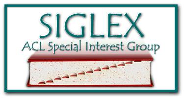
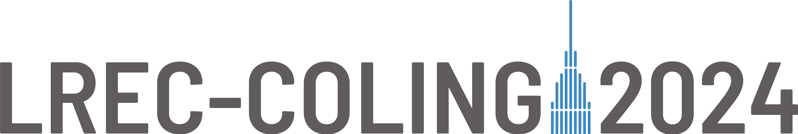
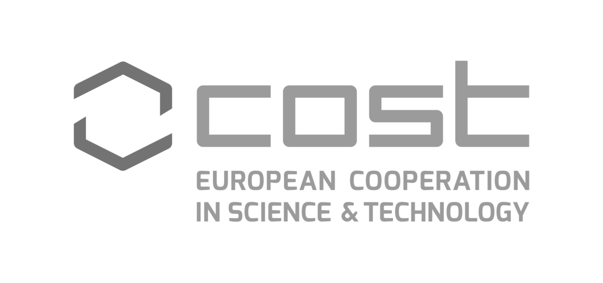
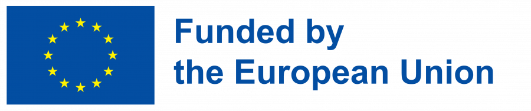

<h2>Joint Workshop on Multiword Expressions and Universal Dependencies (MWE-UD 2024)</h2>

**Colocated with:** [LREC-COLING 2024](https://lrec-coling-2024.org) (Torino, Italia)

**Date of the Workshop:** May 25, 2024 

**Organised and sponsored by:**\
The Special Interest Group on the Lexicon ([SIGLEX](http://www.siglex.org/)) of the Association for Computational Linguistics ([ACL](https://www.aclweb.org/portal/)), SIGLEX's Multiword Expressions Section ([SIGLEX-MWE](https://multiword.org/organization/constitution.html)), Universal Dependencies ([UD](https://universaldependencies.org)) and [UniDive](https://unidive.lisn.upsaclay.fr) Cost Action CA21167.

<a href="https://twitter.com/multiword?ref_src=twsrc%5Etfw" class="twitter-follow-button" data-size="large" data-show-screen-name="true" data-show-count="false">@multiword</a>

-----

### News

* **May 30, 2024**: Proceedings available
* **April 30, 2024**: Detailed tentative schedule online
* **April 5, 2024**: Acceptance notifications for nonarchival presentations sent
* **April 2, 2024**: Acceptance notifications for archival papers sent
* **February 19, 2024**: MWE-UD 2024 workshop final CfP posted with extended deadline (new submission date: March 3, 2024)
* **February 19, 2024**: MWE-UD 2024 workshop ARR commitment date set (ARR Commitment Date: March 25, 2024)
* **January 31, 2024**: Second CfP posted
* **January 16, 2024**: Keynote speaker Natalia Levshina confirmed
* **January 18, 2024**: Keynote speaker Harish Tayyar Madabushi confirmed
* **December 8, 2023**: First CfP posted
* **December 8, 2023**: MWE-UD 2024 workshop date confirmed (Workshop Date: May 25, 2024)
* **November 21, 2023**: MWE-UD 2024 proposal accepted to LREC-COLING 2024
* **August 29, 2023**: Organising committee formed
  
-----

  

    Contents on this page
  

- [Proceedings and video recording](#proceedings-video)
- [Program](#program)
- [Keynote Speakers](#keynotes)
- [Registration](#registration)
- [Description](#description)
- [Submission Formats](#submission)
- [Paper Submission and Templates](#instructions)
- [Best Paper Award and Travel Grants](#award)
- [Important Dates](#dates)
- [Organizing Committee](#organizers)
- [Program Committee](#committee)
- [Sponsors and Support](#sponsors)
- [Anti-harassment Policy](#antiharassment)
- [Contact](#contact)

------

<!-- Does not work...
* TOC
{:toc}

-----
-->

### <a name="proceedings-video"> Proceedings and video recording </a>

The [proceedings](https://aclanthology.org/volumes/2024.mwe-1/) are available in the ACL Anthology.

-----

### <a name="program"> Program </a>

Subject to change.

Note: presentations marked “non-archival” are either already published
elsewhere or work in progress. They have not undergone MWE-UD 2024’s formal
peer review progress and are not included in the proceedings, only listed in
the programme. Due to last-minute changes in the lineup of non-archival
presentations, the version here differs slightly from the one in the
proceedings.

**Date:** Saturday, 25 May 2024 
**Location:** Room “Madrid”, Lingotto Conference Centre, Turin, Italy 
**Zoom link:** see Catalyst conference app

<table class="program">
    <tr>
        <th>Time</th>
        <th>Session</th>
    </tr>
    <tr>
        <th>09:00–09:05</th>
        <th>Welcome</th>
    </tr>
    <tr>
        <td></td>
        <td>Session chair: Voula Giouli</td>
    </tr>
    <tr>
        <th>09:05–09:50</th>
        <th>Keynote 1</th>
    </tr>
    <tr>
        <td></td>
        <td>Session chair: Voula Giouli</td>
    </tr>
    <tr>
        <td></td>
        <td>
            <i>Every Time We Hire an LLM, the Reasoning Performance of the Linguists Goes Up</i> 
            Harish Tayyar Madabushi 
            [<a href="#tayyar-madabushi">abstract</a>]
            [<a href="slides/tayyar-madabushi-2024-every-slides.pdf">slides</a>]
        </td>
    </tr>
    <tr>
        <th>09:50–10:30</th>
        <th>Oral session 1</th>
    </tr>
    <tr>
        <td></td>
        <td>Session chair: Lifeng Han</td>
    </tr>
    <tr>
        <td></td>
        <td>
            <i>Assessing BERT’s sensitivity to idiomaticity</i> 
            Li Liu and Francois Lareau 
            [<a href="https://aclanthology.org/2024.mwe-1.4/">paper</a>]
            [<a href="slides/liu-lareau-2024-assessing-slides.pdf">slides</a>]
        </td>
    </tr>
    <tr>
        <td></td>
        <td>
            <i>Sign of the Times: Evaluating the use of Large Language Models for Idiomaticity Detection</i> 
            Dylan Phelps, Thomas M. R. Pickard, Maggie Mi, Edward Gow-Smith and Aline Villavicencio 
            [<a href="https://aclanthology.org/2024.mwe-1.22/">paper</a>]
            [<a href="slides/phelps-etal-2024-sign-slides.pdf">slides</a>]
        </td>
    </tr>
    <tr>
        <th>10:30–11:00</th>
        <th>Coffee break</th>
    </tr>
    <tr>
        <th>11:00–12:00</th>
        <th>Poster session 1</th>
    </tr>
    <tr>
        <td></td>
        <td>
            <i>Identification and Annotation of Body Part Multiword Expressions in Old Egyptian</i> 
            Roberto Díaz Hernández 
            [<a href="https://aclanthology.org/2024.mwe-1.5/">paper</a>]
            [<a href="posters/diaz-hernandez-2024-identification-poster.pdf">poster</a>]
        </td>
    </tr>
    <tr>
        <td></td>
        <td>
            <i>Diachronic Analysis of Multi-word Expression Functional Categories in Scientific English</i> 
            Diego Alves, Stefania Degaetano-Ortlieb, Elena Schmidt and Elke Teich 
            [<a href="https://aclanthology.org/2024.mwe-1.12/">paper</a>]
            [<a href="posters/alves-etal-2024-diachronic-poster.pdf">poster</a>]
        </td>
    </tr>
    <tr>
        <td></td>
        <td>
            <i>Lexicons Gain the Upper Hand in Arabic MWE Identification</i> 
            Najet Hadj Mohamed, Agata Savary, Cherifa Ben Khelil, Jean-Yves Antoine, Iskandar keskes and Lamia Hadrich-Belguith 
            [<a href="https://aclanthology.org/2024.mwe-1.13/">paper</a>]
            [<a href="posters/hadj-mohamed-etal-2024-lexicons-poster.pdf">poster</a>]
        </td>
    </tr>
    <tr>
        <td></td>
        <td>
            <i>Revisiting VMWEs in Hindi: Annotating Layers of Predication</i> 
            Kanishka Jain and Ashwini Vaidya 
            [<a href="https://aclanthology.org/2024.mwe-1.14/">paper</a>]
            [<a href="posters/jain-vaidya-2024-revisiting-poster.pdf">poster</a>]
        </td>
    </tr>
    <tr>
        <td></td>
        <td>
            <i>Combining Grammatical and Relational Approaches. A Hybrid Method for the Identification of Candidate Collocations from Corpora</i> 
            Damiano Perri, Irene Fioravanti, Osvaldo Gervasi and Stefania Spina 
            [<a href="https://aclanthology.org/2024.mwe-1.18/">paper</a>]
            [<a href="posters/perri-etal-2024-combining-poster.pdf">poster</a>]
        </td>
    </tr>
    <tr>
        <td></td>
        <td>
            <i>Multiword Expressions between the Corpus and the Lexicon: Universality, Idiosyncrasy, and the Lexicon-Corpus Interface</i> 
            Verginica Barbu Mititelu, Voula Giouli, Stella Markantonatou, Ivelina Stoyanova, Petya Osenova, Kilian Evang, Daniel Zeman, Simon Krek, Carole Tiberius, Christian Chiarcos and Ranka Stanković 
            [<a href="https://aclanthology.org/2024.mwe-1.19/">paper</a>]
            [<a href="posters/barbu-mititelu-etal-2024-multiword-poster.pdf">poster</a>]
        </td>
    </tr>
    <tr>
        <td></td>
        <td>
            <i>MultiMWE: Building a Multi-lingual Multi-Word Expression (MWE) Parallel Corpora</i> 
            Lifeng Han, Gareth Jones and Alan Smeaton 
            [non-archival] [<a href="posters/han-etal-2024-multimwe-poster.pdf">poster</a>]
        </td>
    </tr>
    <tr>
        <td></td>
        <td>
            <i>A demonstration of MWE-Finder and MWE-Annotator</i> 
            Jan Odijk, Martin Kroon, Tijmen Baarda, Ben Bonfil and Sheean Spoel 
            [non-archival] [<a href="posters/odijk-etal-2024-demonstration-poster.pdf">poster</a>]
        </td>
    </tr>
    <tr>
        <td></td>
        <td>
            <i>Is Less More? Quality, Quantity and Context in Idiom Processing with Natural Language Models</i> 
            Agne Knietaite, Adam Allsebrook, Anton Minkov, Adam Tomaszewski, Norbert Slinko, Richard Johnson, Thomas Pickard and Aline Villavicencio 
            [non-archival] [<a href="posters/knietaite-etal-2024-less-poster.pdf">poster</a>]
        </td>
    </tr>
    <tr>
        <td></td>
        <td>
            <i>Annotating Compositionality Scores for Irish Noun Compounds is Hard Work</i> 
            Abigail Walsh, Teresa Clifford, Emma Daly, Jane Dunne, Brian Davis and Gearóid Ó Cleircín 
            [non-archival] [<a href="posters/walsh-etal-2024-annotating-poster.pdf">poster</a>]
        </td>
    </tr>
    <tr>
        <th>12:00–13:00</th>
        <th>Oral session 2</th>
    </tr>
    <tr>
        <td></td>
        <td>Session chair: Joakim Nivre</td>
    </tr>
    <tr>
        <td></td>
        <td>
            <i>Universal Feature-based Morphological Trees</i> 
            Federica Gamba, Abishek Stephen and Zdeněk Žabokrtský 
            [<a href="https://aclanthology.org/2024.mwe-1.17/">paper</a>]
            [<a href="slides/gamba-etal-2024-universal-slides.pdf">slides</a>]
        </td>
    </tr>
    <tr>
        <td></td>
        <td>
            <i>Light Verb Constructions in Universal Dependencies for South Asian Languages</i> 
            Abishek Stephen and Daniel Zeman 
            [<a href="https://aclanthology.org/2024.mwe-1.21/">paper</a>]
            [<a href="slides/stephen-zeman-2024-light-slides.pdf">slides</a>]
        </td>
    </tr>
    <tr>
        <td></td>
        <td>
            <i>Strategies for the Annotation of Pronominalised Locatives in Turkic Universal Dependency Treebanks</i> 
            Jonathan Washington, Çağrı Çöltekin, Furkan Akkurt, Bermet Chontaeva, Soudabeh Eslami, Gulnura Jumalieva, Aida Kasieva, Aslı Kuzgun, Büşra Marşan and Chihiro Taguchi 
            [<a href="https://aclanthology.org/2024.mwe-1.25/">paper</a>]
            [<a href="slides/washington-etal-2024-strategies-slides.pdf">slides</a>]
        </td>
    </tr>
    <tr>
        <th>13:00–14:00</th>
        <th>Lunch</th>
    </tr>
    <tr>
        <th>14:00–14:45</th>
        <th>Keynote 2</th>
    </tr>
    <tr>
        <td></td>
        <td>Session chair: Gosse Bouma</td>
    </tr>
    <tr>
        <td></td>
        <td>
            <i>Using Universal Dependencies for testing hypotheses about communicative efficiency</i> 
            Natalia Levshina 
            [<a href="#levshina">abstract</a>]
            [<a href="slides/levshina-2024-using-slides.pdf">slides</a>]
        </td>
    </tr>
    <tr>
        <th>14:45–15:00</th>
        <th>Booster session: virtual presentations</th>
    </tr>
    <tr>
        <td></td>
        <td>Session chair: Kilian Evang</td>
    </tr>
    <tr>
        <td></td>
        <td>
            <i>Automatic Manipulation of Training Corpora to Make Parsers Accept Real-world Text</i> 
            Hiroshi Kanayama, Ran Iwamoto, Masayasu Muraoka, Takuya Ohko and Kohtaroh Miyamoto 
            [<a href="https://aclanthology.org/2024.mwe-1.3/">paper</a>]
            [<a href="slides/kanayama-etal-2024-automatic-slides.pdf">slides</a>]
            [<a href="https://uni-duesseldorf.sciebo.de/s/yaghCBY7G06iDXQ">booster video</a>]
            [<a href="https://uni-duesseldorf.sciebo.de/s/ZLurxPhmTIZxypw">presentation video</a>]
        </td>
    </tr>
    <tr>
        <td></td>
        <td>
            <i>Fitting Fixed Expressions into the UD Mould: Swedish as a Use Case</i> 
            Lars Ahrenberg 
            [<a href="https://aclanthology.org/2024.mwe-1.6/">paper</a>]
            [<a href="slides/ahrenberg-2024-fitting-slides.pdf">slides</a>]
            [<a href="https://uni-duesseldorf.sciebo.de/s/eIUpmzpu7ofKcM1">booster video</a>]
            [<a href="https://uni-duesseldorf.sciebo.de/s/UxEdsdxFVpA6nls">presentation video</a>]
        </td>
    </tr>
    <tr>
        <td></td>
        <td>
            <i>The Vedic Compound Dataset</i> 
            Sven Sellmer and Oliver Hellwig 
            [<a href="https://aclanthology.org/2024.mwe-1.8/">paper</a>]
            [<a href="slides/sellmer-hellwig-2024-vedic-slides.pdf">slides</a>]
            [<a href="https://uni-duesseldorf.sciebo.de/s/kvtWeonYg8Jfap0">booster video</a>]
            [<a href="https://uni-duesseldorf.sciebo.de/s/KTVUW2HgghX2u30">presentation video</a>]
        </td>
    </tr>
    <tr>
        <td></td>
        <td>
            <i>Overcoming Early Saturation on Low-Resource Languages in Multilingual Dependency Parsing</i> 
            Jiannan Mao, Chenchen Ding, Hour Kaing, Hideki Tanaka, Masao Utiyama and Tadahiro Matsumoto. 
            [<a href="https://aclanthology.org/2024.mwe-1.10/">paper</a>]
            [<a href="slides/mao-etal-2024-overcoming-slides.pdf">slides</a>]
            [<a href="https://uni-duesseldorf.sciebo.de/s/NXkE2l13VAB4nMD">booster video</a>]
            [<a href="https://uni-duesseldorf.sciebo.de/s/hWJqZlgn1YpbJwz">presentation video</a>]
        </td>
    </tr>
    <tr>
        <td></td>
        <td>
            <i>Towards the semantic annotation of SR-ELEXIS corpus: Insights into Multiword Expressions and Named Entities</i> 
            Cvetana Krstev, Ranka Stanković, Aleksandra Marković and Teodora Mihajlov 
            [<a href="https://aclanthology.org/2024.mwe-1.15/">paper</a>]
            [<a href="slides/krstev-etal-2024-towards-slides.pdf">slides</a>]
            [<a href="https://uni-duesseldorf.sciebo.de/s/ldJuapRxN9TrFwa">booster video</a>]
            [<a href="https://uni-duesseldorf.sciebo.de/s/rTadfDyy4nRimOc">presentation video</a>]
        </td>
    </tr>
    <tr>
        <td></td>
        <td>
            <i>Universal Dependencies for Saraiki</i> 
            Meesum Alam, Francis Tyers, Emily Hanink and Sandra Kübler 
            [<a href="https://aclanthology.org/2024.mwe-1.23/">paper</a>]
            [<a href="slides/alam-etal-2024-universal-slides.pdf">slides</a>]
            [<a href="https://uni-duesseldorf.sciebo.de/s/PROUgul1T0GSTdb">booster video</a>]
            [<a href="https://uni-duesseldorf.sciebo.de/s/AabHS3vqfI7UkvD">presentation video</a>]
        </td>
    </tr>
    <tr>
        <td></td>
        <td>
            <i>BERT-based Idiom Identification using Language Translation and Word Cohesion</i> 
            Arnav Yayavaram, Siddharth Yayavaram, Prajna Devi Upadhyay and Apurba Das 
            [<a href="https://aclanthology.org/2024.mwe-1.26/">paper</a>]
            [<a href="slides/yayavaram-etal-2024-bert-slides.pdf">slides</a>]
            [<a href="https://uni-duesseldorf.sciebo.de/s/9VzrUJRxuy1kd66">booster video</a>]
            [<a href="https://uni-duesseldorf.sciebo.de/s/TPP9XJ9WDhLO3J1">presentation video</a>]
        </td>
    </tr>
    <tr>
        <th>15:00–16:00</th>
        <th>Oral session 3</th>
    </tr>
    <tr>
        <td></td>
        <td>Session chair: TBD</td>
    </tr>
    <tr>
        <td></td>
        <td>
            <i>To Leave No Stone Unturned: Annotating Verbal Idioms in the Parallel Meaning Bank</i> 
            Rafael Ehren, Kilian Evang and Laura Kallmeyer 
            [<a href="https://aclanthology.org/2024.mwe-1.16/">paper</a>]
            [<a href="slides/ehren-etal-2024-leave-slides.pdf">slides</a>]
        </td>
    </tr>
    <tr>
        <td></td>
        <td>
            <i>Annotation of Multiword Expressions in the SUK 1.0 Training Corpus of Slovene: Lessons Learned and Future Steps</i> 
            Jaka Čibej, Polona Gantar and Mija Bon 
            [<a href="https://aclanthology.org/2024.mwe-1.20/">paper</a>]
            [<a href="slides/cibej-etal-2024-annotation-slides.pdf">slides</a>]
        </td>
    </tr>
    <tr>
        <td></td>
        <td>
            <i>Ad Hoc Compounds for Stance Detection</i> 
            Qi Yu, Fabian Schlotterbeck, Hening Wang, Naomi Reichmann, Britta Stolterfoht, Regine Eckardt and Miriam Butt 
            [<a href="https://aclanthology.org/2024.mwe-1.27/">paper</a>]
            [<a href="slides/yu-etal-2024-ad-slides.pdf">slides</a>]
        </td>
    </tr>
    <tr>
        <th>16:00–16:30</th>
        <th>Coffee break</th>
    </tr>
    <tr>
        <th>16:30–17:20</th>
        <th>Poster session 2</th>
    </tr>
    <tr>
        <td></td>
        <td>
            <i>Synthetic-Error Augmented Parsing of Swedish as a Second Language: Experiments with Word Order</i> 
            Arianna Masciolini, Emilie Francis and Maria Irena Szawerna 
            [<a href="https://aclanthology.org/2024.mwe-1.7/">paper</a>]
            [<a href="posters/masciolini-etal-2024-synthetic-poster.pdf">poster</a>]
        </td>
    </tr>
    <tr>
        <td></td>
        <td>
            <i>A Universal Dependencies Treebank for Gujarati</i> 
            Mayank Jobanputra, Maitrey Mehta and Çağrı Çöltekin 
            [<a href="https://aclanthology.org/2024.mwe-1.9/">paper</a>]
            [<a href="posters/jobanputra-etal-2024-universal-poster.pdf">poster</a>]
        </td>
    </tr>
    <tr>
        <td></td>
        <td>
            <i>Part-of-Speech Tagging for Northern Kurdish</i> 
            Peshmerge Morad, Sina Ahmadi and Lorenzo Gatti 
            [<a href="https://aclanthology.org/2024.mwe-1.11/">paper</a>]
            [<a href="posters/morad-etal-2024-part-poster.pdf">poster</a>]
        </td>
    </tr>
    <tr>
        <td></td>
        <td>
            <i>Domain-Weighted Batch Sampling for Neural Dependency Parsing</i> 
            Jacob Striebel, Daniel Dakota and Sandra Kübler 
            [<a href="https://aclanthology.org/2024.mwe-1.24/">paper</a>]
            [<a href="posters/striebel-etal-2024-domain-poster.pdf">poster</a>]
        </td>
    </tr>
    <tr>
        <td></td>
        <td>
            <i>AlphaMWE-Arabic: Arabic Edition of Multilingual Parallel Corpora with Multiword Expression Annotations</i> 
            Najet Hadj Mohamed, Malak Rassem, Lifeng Han and Goran Nenadic 
            [non-archival] [<a href="posters/hadj-mohamed-etal-2024-alphamwe-poster.pdf">poster</a>]
        </td>
    </tr>
    <tr>
        <td></td>
        <td>
            <i>MaiBaam: A Multi-Dialectal Bavarian Universal Dependency Treebank</i> 
            Verena Blaschke, Barbara Kovačić, Siyao Peng, Hinrich Schütze and Barbara Plank 
            [non-archival] [<a href="posters/blaschke-etal-2024-maibaam-poster.pdf">poster</a>]
        </td>
    </tr>
    <tr>
        <td></td>
        <td>
            <i>Redefining Syntactic and Morphological Tasks for Typologically Diverse Languages</i> 
            Omer Goldman, Leonie Weissweiler and Reut Tsarfaty 
            [non-archival] [<a href="posters/goldman-etal-2024-redefining-poster.pdf">poster</a>]
        </td>
    </tr>
    <tr>
        <td></td>
        <td>
            <i>UCxn: Typologically Informed Annotation of Constructions Atop Universal Dependencies</i> 
            Leonie Weissweiler, Nina Böbel, Kirian Guiller, Santiago Herrera, Wesley Scivetti, Arthur Lorenzi, Nurit Melnik, Archna Bhatia, Hinrich Schütze, Lori Levin, Amir Zeldes, Joakim Nivre, William Croft and Nathan Schneider 
            [non-archival] [<a href="posters/weissweiler-etal-2024-ucxn-poster.pdf">poster</a>]
        </td>
    </tr>
    <tr>
        <td></td>
        <td>
            <i>Sparse Logistic Regression with High-order Features for Automatic Grammar Rule Extraction from Treebanks</i> 
            Santiago Herrera, Caio Corro and Sylvain Kahane 
            [non-archival] [<a href="posters/herrera-etal-2024-sparse-poster.pdf">poster</a>]
        </td>
    </tr>
    <tr>
        <td></td>
        <td>
            <i>Joint Annotation of Morphology and Syntax in Dependency Treebanks</i> 
            Bruno Guillaume, Kim Gerdes, Kirian Guiller, Sylvain Kahane and Yixuan Li 
            [non-archival] [<a href="posters/guillaume-etal-2024-joint-poster.pdf">poster</a>]
        </td>
    </tr>
    <tr>
        <th>17:20–18:00</th>
        <th>Best paper award, announcements, community discussion</th>
    </tr>
    <tr>
        <td></td>
        <td>Session chair: Voula Giouli</td>
    </tr>
</table>

------

### <a name="keynotes">Keynote Speakers </a>

#### <a name="levshina">Natalia Levshina: Using Universal Dependencies for testing hypotheses about communicative efficiency</a>

**Abstract:** There is abundant evidence that language structure and use are
influenced by language users’ tendency to be efficient, trying to minimize the
cost-to-benefit ratio of communication (e.g., Hawkins, 2004; Gibson et al.,
2019; Levshina, 2022). In my talk I will show how data from corpora annotated
with Universal Dependencies can be used for testing hypotheses about the role
of communicative efficiency in shaping up language structure and use. The
hypotheses are as follows:

1. As discussed by typologists (Sapir, 1921; Sinnemäki, 2008), rigid word order can
compensate for lack of formal marking of core arguments. The hypothesis is then that
there are positive correlations between the entropy of subject and object in a transitive
clause in a corpus and the relative frequency of disambiguating case forms or verb
forms. These correlations are expected to minimize the articulation effort involved in
the use of argument flags or indices.

2. There is a positive correlation between semantic tightness (Hawkins, 1986),
operationalized as Mutual Information between lexemes and syntactic roles, and the
relative frequency of verb-final clauses in a corpus. Strong associations between
lexemes and roles help to avoid the costs of reanalysis in verb-final languages.

3. There is a negative correlation between the relative frequency of verb-final clauses in
the clause and the average number of overt core arguments, which helps to save
processing costs required for keeping longer dependencies in mind (cf. Ueno &amp;
Polinsky, 2009).

These hypotheses will be tested on corpus data annotated with Universal Dependencies, with
the help of mixed-effects models with genealogical and geographic information as random
effects.

##### References

Gibson, Edward, Richard Futrell, Steven P. Piantadosi, Isabelle Dautriche, Kyle Mahowald,
Leon Bergen &amp; Roger Levy. 2019. How efficiency shapes human language. *Trends in
Cognitive Science* 23(5): 389-407. https://doi.org/10.1016/j.tics.2019.02.003

Hawkins, John A. 1986. *A Comparative Typology of English and German: Unifying the
Contrasts*. London: Croom-Helm.

Hawkins, John A. 2004. *Efficiency and Complexity in Grammars*. Oxford: Oxford University
Press.

Levshina, Natalia. 2022. *Communicative Efficiency: Language Structure and Use*.
Cambridge: Cambridge University Press.

Sapir, Edward. 1921. *Language: An Introduction to the Study of Speech*. New York: Harcourt.

Sinnemäki, Kaius. 2008. Complexity trade-offs in core argument marking. In: Matti
Miestamo, Kaius Sinnemäki and Fred Karlsson (eds.), *Language Complexity: Typology,
Contact, Change*, 67–88. Amsterdam: John Benjamins.

Ueno, Mieko &amp; Maria Polinsky. 2009. Does headedness affect processing? A new look at the
VO-OV contrast. *Journal of Linguistics* 45: 675–710.

**Bio:**  [Dr. Natalia Levshina](https://www.ru.nl/personen/levshina-n) is an
assistant professor of communication and computational methods at Radboud
University in Nijmegen, Netherlands. Her main research interests are linguistic
typology, corpora, AI, cognitive and functional linguistics. After obtaining
her PhD at the University of Leuven in 2011, she has worked in Jena, Marburg,
Louvain-la-Neuve and Leipzig, where she got her habilitation qualification in
2019, followed by a research position at the Max Planck Institute for
Psycholinguistics in Nijmegen. She has published a book “Communicative
Efficiency: Language structure and use” (Cambridge University Press, 2022), in
which she formulates the main principles of communicatively efficient
linguistic behaviour and shows how these principles can explain why human
languages are the way they are. Natalia is also the author of a best-selling
statistical manual “How to Do Linguistics with R” (Benjamins, 2015).

#### <a name="tayyar-madabushi">Harish Tayyar Madabushi: Every Time We Hire an LLM, the Reasoning Performance of the Linguists Goes Up</a>

**Abstract:** Pre-Trained Language Models (PLMs), trained on the cloze-like
task of masked language modelling, have demonstrated access to a broad range of
linguistic information, including both syntax and semantics. Given their access
to both syntax and semantics, coupled with their data-driven foundations, which
align with usage-based theories, it is valuable and interesting to examine the
constructional information they encode. Early work confirmed that these models
have access to a substantial amount of constructional information. However,
more recent research focusing on the types of constructions PLMs can accurately
interpret, and those they find challenging, suggests that an increase in
schematicity correlates with a decline in model proficiency. Crucially,
schematicity—the extent to which constructional slots are fixed or allow for a
range of elements that satisfy a particular semantic role associated with the
slot—correlates to the extent of “reasoning” needed to interpret constructions,
a task that poses significant challenges for language models. In this talk, I
will begin by reviewing the constructional information encoded in both earlier
models and more recent large language models. I will explore how these aspects
are intertwined with the models' reasoning abilities and introduce promising
new approaches that could integrate theoretical insights from linguistics with
practical, data-driven approaches of PLMs.

**Bio:** [Dr. Tayyar
Madabushi](https://researchportal.bath.ac.uk/en/persons/harish-tayyar-madabushi)'s
research focuses on understanding the fundamental mechanisms that underpin the
performance and functioning of Large Language Models. His work on LLMs was
included in the discussion paper on the Capabilities and Risks of Frontier AI,
which was used as one of the foundational research works for discussions at the
UK AI Safety Summit held at Bletchley Park. His research on the constructional
information encoded in language models has been influential in bringing
together the fields of construction grammar and pre-trained language models. In
addition, his work on language models includes collaborative industrial
research aimed at rectifying biases in speech-to-text systems widely utilised
across the UK. Before starting his PhD in automated question answering at the
University of Birmingham, Dr. Tayyar Madabushi founded and headed a social
media data analytics company based in Singapore.

------

### <a name="registration"> Registration </a>

To attend the workshop (either in person or virtually), please register through
[LREC-COLING 2024’s registration
system](https://lrec-coling-2024.org/registration-2/). Note that to attend
MWE-UD 2024, it is sufficient to select this workshop during registration; you
do not have to register for the main conference.

------

### <a name="description"> Description </a>

Multiword expressions (MWEs) are word combinations that exhibit lexical, syntactic, semantic, pragmatic, and/or statistical idiosyncrasies (Baldwin and Kim, 2010), such as by and large, hot dog, pay a visit and pull someone's leg. The notion encompasses closely related phenomena: idioms, compounds, light-verb constructions, phrasal verbs, rhetorical figures, collocations, institutionalized phrases, etc. Their behavior is often unpredictable; for example, their meaning often does not result from the direct combination of the meanings of their parts. Given their irregular nature, MWEs often pose complex problems in linguistic modeling (e.g. annotation), NLP tasks (e.g. parsing), and end-user applications (e.g. natural language understanding and MT), hence still representing an open issue for computational linguistics (Constant et al., 2017).

Universal Dependencies (UD; De Marneffe et al., 2021) is a framework for cross-linguistically consistent treebank annotation that has so far been applied to over 100 languages. The framework aims to capture similarities as well as idiosyncrasies among typologically different languages (e.g., morphologically rich languages, pro-drop languages, and languages featuring clitic doubling). The goal in developing UD was not only to support comparative evaluation and cross-lingual learning but also to facilitate multilingual natural language processing and enable comparative linguistic studies.

After independently running a successful series of workshops, the MWE and UD communities are now joining forces to organize a joint workshop. This is a timely collaboration because the two communities clearly have overlapping interests. For instance, while UD has several dependency relations that can be used to annotate MWEs, both annotation guidelines (i.e. is syntactic irregularity and inflexibility or semantic non-compositionality the leading criterion?) and annotation practice (both across treebanks for a single language and across languages) for these relations can be improved (Schneider and Zeldes, 2021). The PARSEME MWE-annotated corpora for 26 languages build on UD annotated corpora (Savary et al., 2023). Both communities share an interest in developing guidelines, data-sets, and tools that can be applied to a wide range of typologically diverse languages, raising fundamental questions about tokenization, lemmatization, and morphological decomposition of tokens. Proposals for harmonizing annotation practice between what has been achieved in PARSEME and UD and expanding PARSEME MWE annotation to non-verbal MWEs are also central to the recently started UniDive COST action (CA21167). 

The workshop invites submissions of original research on MWE, UD, and the interplay of both. In particular, the following topics are especially relevant: 
- Sensitivity of LLMs to MWE and syntactic dependencies. Studies along the lines of Manning et al. (2020) (UD), Nedumpozhimana and Kelleher (2021), Garcia et al. (2021), Fakharian and Cook (2021), Moreau et al. (2018) (MWE), and others on the question to what extent LLMs make use of syntactic dependencies or are capable of detecting MWEs and capturing their semantics. 
- Applicability of UD and MWE annotation and discovery for low-resource and typologically diverse languages and language varieties. Both UD and PARSEME aim at universal applicability across a wide range of languages. Much theoretical, computational, and empirical work concentrates on high-resource languages however. Applying these frameworks to typologically diverse languages may lead one to reconsider the notion of token, word, and morphological segmentation, and to reassess the notion of MWE for languages that feature compounding or incorporation (Baldwin et al., 2021; Haspelmath, 2023).
- Case studies.  Studies on the  consistency,  coverage or universal applicability of MWE annotation in the UD or PARSEME frameworks, as well as studies on automatic detection and interpretation of MWEs in corpora.
- MWE and UD processing to enhance end-user applications. MWEs have gained particular attention in end-user applications, including MT (Zaninello and Birch, 2020; Han et al., 2021), simplification (Kochmar et al., 2020), language learning and assessment (Paquot et al., 2019; Christiansen and Arnon, 2017), social media mining (Maisto et al., 2017), and abusive language detection (Zampieri et al., 2020; Caselli et al., 2020). We believe that it is crucial to extend and deepen these first attempts to integrate and evaluate MWE technology in these and further end-user applications.
- Testing developed systems on the latest dataset versions. Authors are also encouraged to submit papers that test the developed systems using the recent UD 2.13 and/or PARSEME 1.3 releases.

-----

<!--### <a name="shared-task">Shared task</a>

TBD

-----
-->

### <a name="submission">Submission Formats</a>

The workshop invites  two types of submissions:

- Archival submissions that present substantially original research in both long paper format (8 pages + references) and short paper format (4 pages + references)
- Non-archival submissions of abstracts describing relevant research presented/published elsewhere which will not be included in the MWE-UD proceedings.

-----

### <a name="instructions">Paper Submission and Templates</a>

Papers should be submitted via the workshop’s [START submission page](https://softconf.com/lrec-coling2024/mwe-ud2024/). Please choose the appropriate submission format (archival/non-archival). Submissions must follow the [LREC-COLING 2024 stylesheet](https://lrec-coling-2024.org/authors-kit/).

When submitting a paper from the START page, authors will be asked to provide essential information about resources (in a broad sense, i.e. also technologies, standards, evaluation kits, etc.) that have been used for the research described in the paper or are a new result of the research. Moreover, ELRA encourages all LREC-COLING authors to share the described LRs (data, tools, services, etc.) to enable their reuse and replicability of experiments (including evaluation ones)

Archival papers with existing reviews from ACL Rolling Review (ARR)) will also be considered. A paper may not be under review through ARR and MWE-UD simultaneously. A paper that has or will receive reviews through ARR may not be submitted for review to MWE-UD.

-----

### <a name="award">Best Paper Award and Travel Grants</a>

- Best paper award criteria TBD
- UniDive members with accepted papers may be eligible for travel reimbursement via UniDive.
- Accepted authors from underrepresented groups (e.g., an underrepresented counry) or accepted authors of work on low-resource languages may be eligible to apply for an ACL-SIGLEX travel grant of upto 500 USD.

-----

### <a name="dates"> Important Dates </a>

| What                       | When                       |
| -------------------------- | -------------------------- |
| Paper submission deadline  | March 3, 2024                        |
| ARR commitment deadline    | March 25, 2024                        |
| Notification of acceptance | April 1, 2024                        |
| Camera-ready papers due    | April 8, 2024                        |
| Underline upload deadline  | TBD                        |
| Workshop                   | May 25, 2024                        |

All deadlines are at 23:59 UTC-12 (Anywhere on Earth).

-----

### <a name="organizers"> Organizing Committee </a>
<!--
| What | Who |
| ---- | --- |
| Program chairs | TBD |
| Publication chair | TBD |
| Coordination and communication chair | TBD |
| Publicity chair | |
-->
<table>
  <tr><td>Archna Bhatia </td><td style="padding-left: 20px;">Institute for Human and Machine Cognition, USA</td></tr>
  <tr><td>Gosse Bouma </td><td style="padding-left: 20px;">Groningen University, NL</td></tr>
  <tr><td>A. Seza Dogruöz </td><td style="padding-left: 20px;">Ghent University, Belgium</td></tr>
  <tr><td>Kilian Evang </td><td style="padding-left: 20px;">Heinrich Heine University Düsseldorf, DE</td></tr>
  <tr><td>Marcos Garcia </td><td style="padding-left: 20px;">University of Santiago de Compostela, Galiza, Spain</td></tr>
  <tr><td>Voula Giouli </td><td style="padding-left: 20px;">Institute for Language & Speech Processing, ATHENA RC, Greece</td></tr>
  <tr><td>Lifeng Han </td><td style="padding-left: 20px;">Univ. of Manchester, UK</td></tr>
  <tr><td>Joakim Nivre </td><td style="padding-left: 20px;">Uppsala University and Research Institutes of Sweden, Sweden</td></tr>
  <tr><td>Alexandre Rademaker </td><td style="padding-left: 20px;">IBM Research, Brazil</td></tr>
</table>

-----

### <a name="committee"> Program Committee </a>

| Verginica Barbu Mititelu   | Romanian Academy           |
| Cherifa Ben Kehlil         | University of Tours        |
| Philippe Blache            | Aix-Marseille Uni |
| Francis Bond               | Palacký University         |
| Claire Bonial              | U.S. Army Research Laboratory |
| Julia Bonn                 | University of Colorado Boulder |
| Tiberiu Boroș              | Adobe                      |
| Marie Candito              | Université Paris Cité      |
| Giuseppe G. A. Celano      | Leipzig Uni | 
| Kenneth Church             | Baidu                      |
| Çağrı Çöltekin             | University of Tübingen     |
| Mathieu Constant           | Université de Lorraine     |
| Monika Czerepowicka        | University of Warmia and Mazury |
| Daniel Dakota              | Indiana University         |
| Miryam de Lhoneux          | KU Leuven                  |
| Marie-Catherine de Marneffe | UC Louvain                 |
| Valeria de Paiva           | Nuance                    |
| Gaël Dias                  | University of Caen Basse-Normandie |
| Kaja Dobrovoljc            | University of Ljubljana    |
| Rafael Ehren               | Heinrich Heine University Düsseldorf |
| Gülşen Eryiğit             | Istanbul Technical University |
| Meghdad Farahmand          | Berlin, Germany            |
| Christiane Fellbaum        | Princeton University       |
| Jennifer Foster            | Dublin City University     |
| Aggeliki Fotopoulou        | Institute for Language and Speech Processing, ATHENA RC |
| Stefan Th. Gries           | UC Santa Barbara & JLU Giessen | 
| Bruno Guillaume            | Université de Lorraine     |
| Tunga Gungor               | Bogaziçi University        |
| Eleonora Guzzi             | Universidade da Coruña     |
| Laura Kallmeyer            | Heinrich Heine University Düsseldorf |
| Cvetana Krstev             | University of Belgrade     |
| Timm Lichte                | University of Tübingen     |
| Irina Lobzhanidze          | Ilia State University      |
| Teresa Lynn                | ADAPT Centre               |
| Stella Markantonatou       | Institute for Language & Speech Processing, ATHENA RC |
| John P. McCrae             | National University of Ireland, Galway |
| Nurit Melnik               | The Open University of Israel |
| Johanna Monti              | "L'Orientale" University of Naples |
| Dmitry Nikolaev            | University of Manchester |
| Jan Odijk                  | University of Utrecht      |
| Petya Osenova              | Bulgarian Academy of Sciences |
| Yannick Parmentier         | University of Lorraine     |
| Agnieszka Patejuk          | University of Oxford and Institute of Computer Science, Polish Academy of Sciences |
| Pavel Pecina               | Charles University |
| Ted Pedersen               | University of Minnesota |
| Prokopis Prokopidis        | Institute for Language and Speech Processing, ATHENA RC |
| Manfred Sailer             | Goethe-Universität Frankfurt am Main |
| Tanja Samardžić            | University of Zurich |
| Agata Savary               | Université Paris-Saclay |
| Nathan Schneider           | Georgetown University |
| Sabine Schulte im Walde    | University of Stuttgart |
| Sebastian Schuster         | Saarland University |
| Matthew Shardlow           | University of Manchester |
| Joaquim Silva              | Universidade NOVA de Lisboa |
| Maria Simi                 | Università di Pisa |
| Ranka Stanković            | University of Belgrade |
| Ivelina Stoyanova          | Bulgarian Academy of Sciences |
| Stan Szpakowicz            | University of Ottawa |
| Shiva Taslimipoor          | University of Cambridge |
| Beata Trawinski            | Leibniz Institute for the German Language |
| Ashwini Vaidya             | Indian Institute of Technology |
| Marion Di Marco            | Ludwig Maximilian University of Munich |
| Amir Zeldes                | Georgetown University |
| Daniel Zeman               | Charles University |

-----

### <a name="sponsors"> Sponsors and Support </a>

    

        
    

    

        
    

    

        
    

    

        
    

    

        
    

    

        
    

-----

### <a name="antiharassment"> Anti-harassment Policy </a>

The workshop follows the [LREC/COLING’s anti-harassment policy](https://coling2022.org/policy).

-----

### <a name="contact"> Contact </a>

For any inquiries regarding the workshop, please send an email to the Organizing Committee at <mweud2024-organizers@uni-duesseldorf.de>.

Please register to [SIGLEX](../organization/members) and check the "MWE
Section" box to be registered to our [mailing list](../mailinglist).

